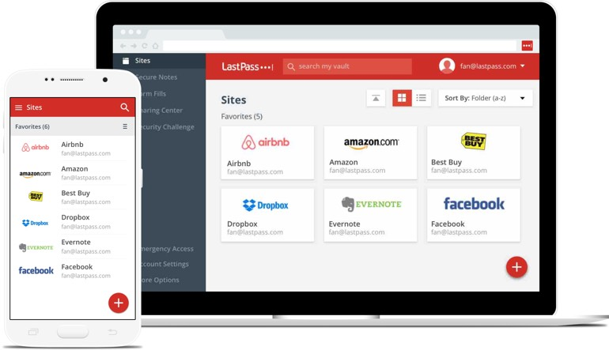

It's easy to get lazy and use the same password for multiple account logins. But doing so leaves you _much_ less secure than having different passwords.

Still, it's near impossible nowadays to remember an ever-expanding number of passwords for different accounts. Last year, I found that I was spending a silly amount of time coming up with passwords, remembering them, typing them in incorrectly, and resetting them.

I consequently started hunting for a solution, and ended up trying out a password manager. It solved my password issues so well, I haven't looked back!

There isn't much to a password manager, and using one has made logging into accounts so much easier and safer. Here's the gist of it in ~1 minute.

## How do password managers work?

A password manager works like a safe. Your passwords are securely stored in an encrypted database, and you access them by entering a master password to decrypt the database.

It's much easier to remember one long, secure password than numerous different ones. And if the safe (encrypted database) is stolen, thieves wont be able read your passwords without the key (master password).

When you need to log in to an account, you simply unlock your database, copy your credentials, and paste them into the login fields.[1] No more straining to type complicated passwords.

When you need a new password, password managers create new ones for you that are hard to crack. Many of them also remind you to change your passwords if it's been a while.

## Which password manager should I use?

I use [KeePass](http://keepass.info/), a free program. KeePass is open-source, meaning that a community of security experts (and anyone else who is interested) is vetting the source code to verify that it really is secure.

  

KeePass, however, is not the most user-friendly service out there. I've played with [LastPass](https://www.lastpass.com/) as an alternative. LastPass keeps your passwords in a "cloud" so you can access them anywhere.[2] LastPass runs on an ad-based model, making it also "free" to use.

  

There are also other password management programs and services out there, though I haven't tried any others personally.

## What if I screw up with a password manager and lose all of my passwords?

If you're worried about losing your passwords and/or aren't sure if a password manager is for you, you always have the option of easing into it. Start by putting one password into the manager for something that isn't critically important, so that you get the hang of using it. As you get more comfortable, you can add more and more passwords.

If anything goes wrong, you can still reset your passwords to online accounts the regular way.

 

---

I hope you take a few minutes out of your day to give a password manager a try. In retrospect, I can't believe it took me so long to take the jump--using a manager has been so much easier than the old system of remembering passwords that weren't as safe anyway.

If you're interested in more on practical online security, stay tuned!

## Footnotes

[1] Some services even offer "Auto-Type", which fills in the login fields for you with one click or shortcut combo!

[2] I get around this problem with KeePass by keeping my password database in a cloud service myself (e.g. Dropbox, OneDrive, etc.).

#### Updated  January 28, 2017
* Added pictures.
* Edited "How do password managers work?" section.
