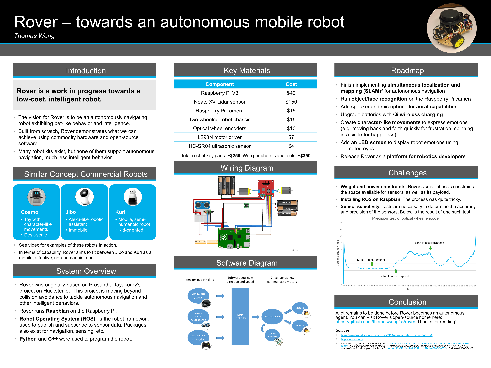

When it comes to applying for opportunities, I'm no different from everyone else: I always get anxious. But preparing an application is often a great way to make your work presentable and gauge your progress.

Earlier this month, I heard about Robotics Day, an all-day event at Microsoft consisting of a series of talks, guided tours of Microsoft Research labs, and an expo showcasing robots built by hobbyist employees. The organizers sent out a call for volunteers and an application for prospective expo presenters.

This event was right up my alley. I was excited at the prospect of connecting with other MS folks doing robotics. I had even been building my own robot these past few months, so the expo was the perfect opportunity to show it off! However, I didn't feel confident about applying for the expo, because I feared my work wouldn't meet the same bar as other presenters. I didn't want to stick out and look like I didn't know what I was doing.

I wavered for a bit about applying, but ultimately I figured that I would give it my best shot and let the organizers decide if I made the cut. I also signed up to be a volunteer, so that in case of rejection, I could at least help out and get to know the organizers.

In the end, I got to do it all: I volunteered, attended the talks, and presented at the expo! I'll focus on my experience at the expo here, so that this post doesn't get too long.

## At the expo
My presentation naturally focused on Rover, the robot that I have been building and programming for almost half a year. Here is a picture of the bot:

  

I am building Rover to be an intelligent, mobile agent, kind of like a pet. A big part of the fun is seeing how much intelligence I can build using off-the-shelf hardware and open-source software. I'll be writing up a more detailed post on building and designing Rover soon.

Rover is still a work in progress, so I put together several materials to aid me with the presentation. Here's a picture of my booth setup:

  

Here's an online version of the poster on the wall; click for a full page view:

  

#### Presentation materials
* __Poster.__ On the poster, I mapped out the project goals, system design, roadmap, and key challenges, and other topics. It served as a handy reference when people asked questions, as I could point out the relevant details quickly.
* __Video.__ I played a short video on loop with clips demoing Rover at different stages of development. I also included demos of robots on the market aiming to be intelligent agents for comparison.
* __Contact info.__ I laid out some paper strips with project links and my contact information for people to take, in case they wanted to connect with me later.

#### How presenting went
The expo lasted for two hours, and lots of people stopped by. I ended up having virtually no downtime, which was great! It was rewarding to see people checking out my robot, looking at my presentation materials, and asking me questions about what I had built.

It was interesting to observe what drew people's attention. My robot was powered on but stationary, and many people were drawn to the booth by the spinning LIDAR on the robot. It turned out that few people knew that fairly inexpensive LIDARs were available for hobby robotics. Once people were engaged, I pitched my vision for Rover as an intelligent pet-like robot, and described the progress I was making towards that goal.

There were a lot of other cool robots on display, like battle robots, mobile robots made with bicycle wheels, and even a foosball-playing robot! All the presenters were really friendly, and we all had a great time demoing our creations.

## What I learned

My biggest takeaway from this experience is realizing how important it is to practice pitching my ideas to other people. Though I had been working on my robot for months, I had very little to show for it besides the physical robot.

Preparing to show my project to other people forced me to distill the nebulous thoughts I had been working with into well-formed concepts. Showing my work also allowed me to gauge how people responded to Rover and get their feedback. And practicing my pitch helped me keep my communication skills sharp.

Finally, I'm learning to become less anxious about applying to things. I want to treat applications more as learning opportunities rather than tests. If I feel overly anxious, not only is it counter productive, but it probably means that I'm overestimating how much I'll lose if I get rejected. It's better to just keep trying, learning, and growing.

 

---

Thanks for reading, and best wishes to you on whatever projects or opportunities you are working towards! Stay tuned for more details about Rover.
