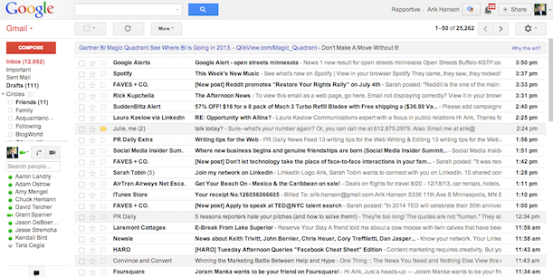
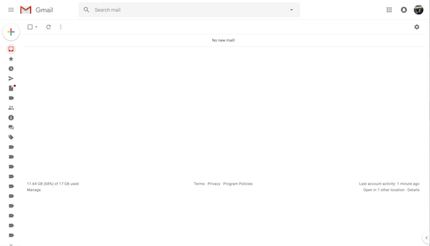

I find it hard to be productive when my inbox is cluttered with emails. It's easy to lose track of high-priority tasks in a messy inbox. 

  
  

    Screenshot of someone's inbox from the Internet. 13k unread emails = instant anxiety.
  

To keep a tidy inbox, I aim for Inbox Zero daily. That means for each email:

1. If there's a task that can be done in a minute, I'll do it immediately and archive it.

2. If there's a task to be done today, I'll add it to my to-do list and then [snooze](https://support.google.com/mail/answer/7622010?co=GENIE.Platform%3DDesktop&hl=en) the email. 

3. If the task isn't urgent, I'll just snooze it to whenever I can/need to do it.

  
  

    Much better!
  

I don't always achieve an empty inbox following this approach, especially when a lot of things are happening at once. The goal may also not always be to clear all emails, if you need some handy for your task for example. 

Though I tried to keep my approach lightweight, there's definitely room for improvement. For example, I'm still experimenting to find a good to-do list workflow. I could be more disciplined about when I check my email to avoid interruptions in my work. So far, though, this method is pretty effective in helping me stay organized. 