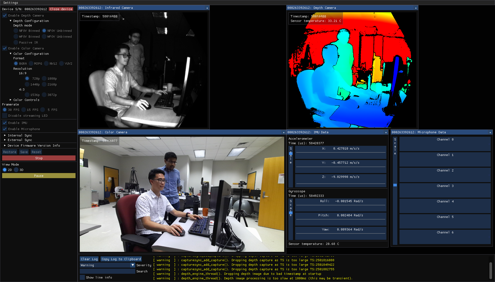

Microsoft recently released the [Azure Kinect DK](https://azure.microsoft.com/en-us/services/kinect-dk/) sensor, a $399 developer-oriented sensor kit for robotics and mixed reality applications. 
The kit's SDK officially supports Windows and Linux 18.04.
I've managed to get the v1.1 SDK working on Ubuntu 16.04, and have documented the steps below. 

# Why downgrade to Ubuntu 16.04? 

Many of the robots I work with or have worked with are tied to Ubuntu 16.04, e.g. the Rethink Robotics Sawyer robot, as well as the PR2.
Upgrading the robot hardware to 18.04 is difficult and would break existing projects.
Although upgrading to 18.04 will eventually be necessary, it is helpful to have the Azure Kinect DK working on 16.04 in the meantime.

# Installation steps
These steps worked for me on an existing Ubuntu 16.04 installation, not a fresh one, so your mileage may vary.

1. Download the v1.1 SDK from Github.[^1]
```console 
$ git clone https://github.com/microsoft/Azure-Kinect-Sensor-SDK/tree/release/1.1.x
```
2. Install dependencies using the provided script.
```console
$ bash ./Azure-Kinect-Sensor-SDK/scripts/bootstrap-ubuntu.sh
```
3. Follow the build steps in [https://github.com/microsoft/Azure-Kinect-Sensor-SDK/blob/release/1.1.x/docs/building.md](https://github.com/microsoft/Azure-Kinect-Sensor-SDK/blob/release/1.1.x/docs/building.md).
    * If you get a CMake error, you may need to upgrade CMake[^2].
```console
% Download and extract cmake 3.14.5
$ mkdir ~/temp
$ cd ~/temp
$ wget https://cmake.org/files/v3.14/cmake-3.14.5.tar.gz
$ tar -xzvf cmake-3.14.5.tar.gz
$ cd cmake-3.14.5/
```
```console
% Install extracted source
$ ./bootstrap
$ make -j4
$ sudo make install
$ cmake --version
```
    * If you get a libsoundio error, you may need to install jack-tools.
```console
$ sudo apt-get install jack-tools
```
4. Get a copy of the depthengine binary `libdepthengine.so.1.0` and missing dependencies

    `libdepthengine.so.1.0` is closed-source code for processing the raw depth stream from the camera.
    This binary is included as part of k4a-tools, the [Azure Kinect SDK Debian package for Ubuntu 18.04](https://docs.microsoft.com/en-us/azure/Kinect-dk/sensor-sdk-download#linux-installation-instructions). 

    As a result, you'll need to install k4a-tools on an Ubuntu 18.04 OS following [these instructions](https://docs.microsoft.com/en-us/azure/Kinect-dk/sensor-sdk-download#linux-installation-instructions), then copy the files installed into `/usr/local/lib/x86_64-linux-gnu` onto your Ubuntu 16.04 OS.[^3]

    In practice, I found that I only needed `libdepthengine.so.1.0` and `libstdc++.so.6` from the `x86_64-linux-gnu` folder.

5. Copy the depthengine binary and missing dependencies into the `bin/` folder generated by the build in step 3.
```console
$ cp path/to/x86_64-linux-gnu/libdepthengine.so.1.0 path/to/Azure-Kinect-Sensor-SDK/build/bin/libdepthengine.so.1.0
$ cp path/to/x86_64-linux-gnu/libstdc++.so.6 path/to/Azure-Kinect-Sensor-SDK/build/bin/libstdc++.so.6
```
6. Test the installation by running the SDK viewer.[^4]
```console
$ sudo path/to/Azure-Kinect-Sensor-SDK/build/bin/k4aviewer
```

    If all went well you be able to open your device and see all data streams coming in as below.

<div class="cntr">
  
  <div class="caption">
    Screenshot from k4aviewer
  </div>
</div>

To integrate the sensor with ROS, take a look at my follow-up post: [How to install ROS drivers for Azure Kinect on Ubuntu 16.04](../azure_kinect_1604_ros/)

---
Footnotes

[^1]: I used commit `fd6f537bb5ad9960faafc80a3cededbc8eb68609`, but a later commit may work.
[^2]: [https://askubuntu.com/questions/355565/how-do-i-install-the-latest-version-of-cmake-from-the-command-line](https://askubuntu.com/questions/355565/how-do-i-install-the-latest-version-of-cmake-from-the-command-line)
[^3]: Or find a friend who has a copy :)
[^4]: There are instructions for running the viewer as non-root [here](https://github.com/microsoft/Azure-Kinect-Sensor-SDK/blob/develop/docs/usage.md#linux-device-setup)