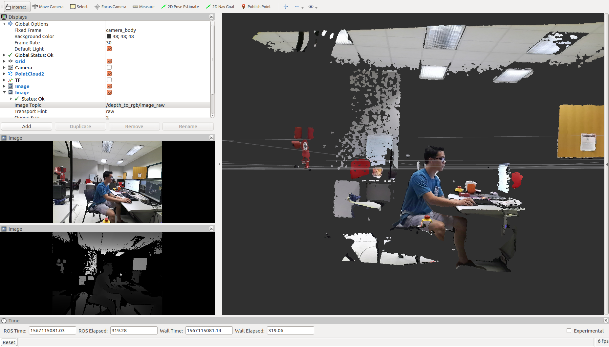

Following up from my previous post on [installing the Azure Kinect SDK on Ubuntu 16.04](../azure_kinect_1604), this post provides instructions for setting up ROS drivers for the Azure Kinect. These instructions apply for ROS kinetic and Ubuntu 16.04. 

The credit for figuring out these steps goes to [Kevin Zhang](https://www.ri.cmu.edu/ri-people/kevin-zhang/)!

# Installation steps
1. Install the Azure Kinect SDK executables on your path so they can be found by ROS.
```console
$ cd path/to/Azure-Kinect-Sensor-SDK/build
$ sudo ninja install
```

2. Clone the official ROS driver into a catkin workspace.[^1]
```console
$ cd catkin_ws/src
$ git clone https://github.com/microsoft/Azure_Kinect_ROS_Driver.git
```

3. Make minor edits to the codebase. If you were to build the workspace now, you would get errors relating to `std::atomic` syntax. 

    To fix this, open `<repo>/include/azure_kinect_ros_driver/k4a_ros_device.h` and convert all instances of `std::atomic_TYPE` type declarations to `std::atomic<TYPE>`. Below is a diff of the edits I made.
```c++
@@ -117,11 +117,11 @@ class K4AROSDevice
     volatile bool running_;
 
     // Last capture timestamp for synchronizing playback capture and imu thread
-    std::atomic_int64_t last_capture_time_usec_;
+    std::atomic<int64_t> last_capture_time_usec_;
 
     // Last imu timestamp for synchronizing playback capture and imu thread
-    std::atomic_uint64_t last_imu_time_usec_;
-    std::atomic_bool imu_stream_end_of_file_;
+    std::atomic<uint64_t> last_imu_time_usec_;
+    std::atomic<bool> imu_stream_end_of_file_;
 
     // Threads
     std::thread frame_publisher_thread_;
```
4. Build the catkin workspace with either `catkin_make` or `catkin build`.

5. Copy the libdepthengine and libstdc++ binaries that you placed in the `Azure_Kinect_SDK/build/bin` folder from my [previous post](../azure_kinect_1604) in your catkin workspace. 
```console
$ cp path/to/Azure_Kinect_SDK/build/bin/libdepthengine.so.1.0 path/to/catkin_ws/devel/lib/
$ cp path/to/Azure_Kinect_SDK/build/bin/libstdc++.so.6 path/to/catkin_ws/devel/lib/
```

    You will have to do this whenever you do a clean build of your workspace.

6. Copy udev rules from the ROS driver repo to your machine. 
```console
$ cp /path/to/Azure_Kinect_ROS_Driver/scripts/99-k4a.rules /etc/udev/rules.d/
```

    Unplug and replug your sensor into the machine after copying the file over.

7. Source your built workspace and launch the driver. 
```console
$ source path/to/catkin_ws/devel/setup.bash
$ roslaunch azure_kinect_ros_driver driver.launch
```

    Note that there are parameters you can adjust in the driver launch file, e.g. FPS, resolution, etc.

8. Run Rviz and you should be able to open Image and PointCloud2 widgets that read topics from the sensor!

<div class="cntr">
  
  <div class="caption">
    Screenshot from RViz
  </div>
</div>

---
Footnotes

[^1]: I used commit `be9a528ddac3f9a494045b7acd76b7b32bd17105`, but a later commit may work.