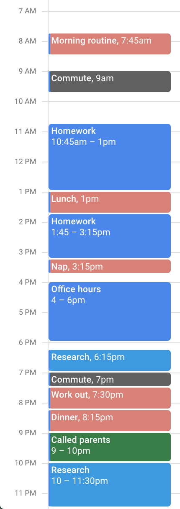

I used to only use my calendar to track upcoming meetings. But then I read Philip Guo's [blog post on time management](http://www.pgbovine.net/time-management.htm), and was fascinated by how he used his calendar to show where his time went. 

  
  

    The color-coding makes it easy to review at a glance.
  

I decided to try Philip's calendaring method to see if I was being as productive as I thought. It's been over a year since I started logging, and I have found it to be not only a great method for gauging my past productivity, but also for kickstarting changes to how I spend time in the future. 

In the rest of this post, I'll describe how I log my time and talk about the insights I've gained in more detail. 

# Logging is simple and flexible

There's not much to it---after working on a task, I create a calendar entry for the time spent and color-code it. I use Google calendar, but any kind of calendar works. Here is an example of what one of my recent work days looks like. 

  
  

    Had a slow morning and missed my bus...didn't want to spend more time looking for an ~ideal~ day
  

I've color-coded the activities as follows: 

<table style="margin-left: auto; margin-right: auto;">
<colgroup>
<col width="40%" />
<col width="80%" />
</colgroup>
<thead>
<!-- <tr class="header">
<th>Color</th>
<th>Category</th>
</tr> -->
</thead>
<tbody>
    <tr>
        <td markdown="span">
            
            Pink
        </td>
        <td markdown="span">
            Health
        </td>
    </tr>
    <tr>
        <td markdown="span">
            
            Grey
        </td>
        <td markdown="span">
            Travel
        </td>
    </tr>
    <tr>
        <td markdown="span">
            
            Blue
        </td>
        <td markdown="span">
            Coursework
        </td>
    </tr>
    <tr>
        <td markdown="span">
             
            Cyan
        </td>
        <td markdown="span">
            Research
        </td>
    </tr>
    <tr>
        <td markdown="span">
            
            Green
        </td>
        <td markdown="span">Social and Family</td>
    </tr>
</tbody>
</table>

The system is very flexible. You can use whatever color categories suit you best. Your labels for each activity can be as simple or as descriptive as you like. You can even adapt it for a productivity methodology like David Allen's [Getting Things Done](https://en.wikipedia.org/wiki/Getting_Things_Done) or Cal Newport's [Deep Work](http://calnewport.com/books/deep-work/). Cal Newport even describes a similar method of logging your time in that book. 

# Logging shows me where my time goes and how to adjust

Since I started using this method, I have a better sense of how I'm spending my time compared to when I relied on my intuition. I'm able to catch patterns of behavior and reinforce them if they are positive, or work on eliminating them if they are negative. For example, I've noticed that my energy and focus dips in late afternoon before returning in the evening. Taking a break from work to nap or exercise helps me get through the slump. 

I also have a better sense of the present. Logging each task helps me be more deliberate about each activity I start, and makes me aware of deviations from my planned schedule quickly, so that I don't reach the end of the day and then realize too late that I went off track.

Some may think it takes a lot of work to log time like this, but it really doesn't take long. To me, the benefit of having a better handle on my time is worth the few moments it takes to do the logging. 

# Some final notes

* If there are events that fit into multiple categories, I don't worry too much about it and just pick one. 
* If you work in thirty minute chunks, it might help to set the default event duration in Google calendar to thirty minutes instead of an hour.
* I also generally try not to have overlapping things in my calendar. If there are conflicting events, I will cancel my appointment with the less important one and move it off my calendar or gray it out. I can't be in two places at the same time anyway.
* Unlike Philip Guo, I keep track of my efficiency level for each task. I found it both difficult and distracting to assess how efficient I was. 
* In a way, this is similar to the post I wrote about how I journal in that it's about recording things down. When I started using this calendar, I stopped journaling my day-to-day items in as much detail because the calendar serves that purpose now. But I'll still put my feelings and thoughts in my journal.